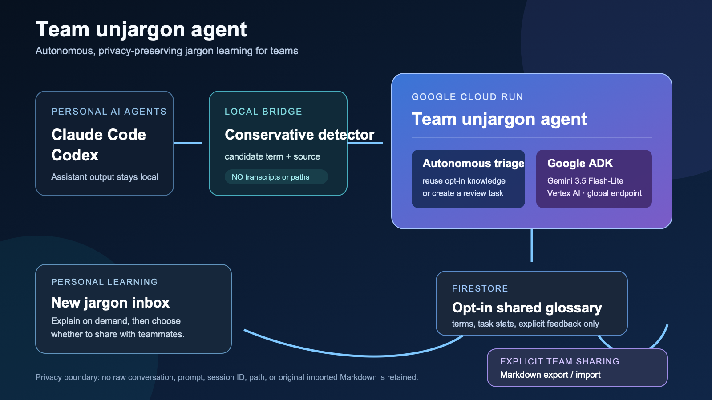

# Architecture



```text
Local detector / connector
  | high-confidence candidate terms + source category only
  v
FastAPI on Cloud Run
  |-- autonomous triage: find an opt-in shared explanation or surface new jargon
  |-- Google ADK + Gemini: draft a concise explanation on demand
  |-- Markdown export/import: explicit personal-to-team sharing
  `-- Firestore: shared terms + candidate-derived task state + explicit feedback
```

The detector calls `POST /api/detection-events` with only candidate terms and a source category. The service automatically checks `teams/demo-team/terms/{normalized-term}` and either shows an opted-in shared explanation or stores a new-jargon task; it does not accept a raw agent message. It saves one latest-run audit record containing only each term and its routing decision, making the autonomous work visible without retaining conversation data. A learner may open a task through `POST /api/explain`, which accepts only a term and member name, where Google ADK + Gemini drafts a definition. `POST /api/feedback` persists an explicit choice to share it. `GET /api/glossary.md` produces normal Markdown, while `POST /api/glossary-import` saves only `## term` headings and their first definition line, then discards the import text.

For local product walkthroughs, `TEAM_UNJARGON_DEMO_MODE=true` uses deterministic responses and in-memory storage. Cloud Run sets it to `false` and `USE_FIRESTORE=true` so the same flow uses Gemini 3.5 Flash-Lite through ADK and Firestore; the Vertex model endpoint uses `global` while the Cloud Run service remains in `us-central1`.
